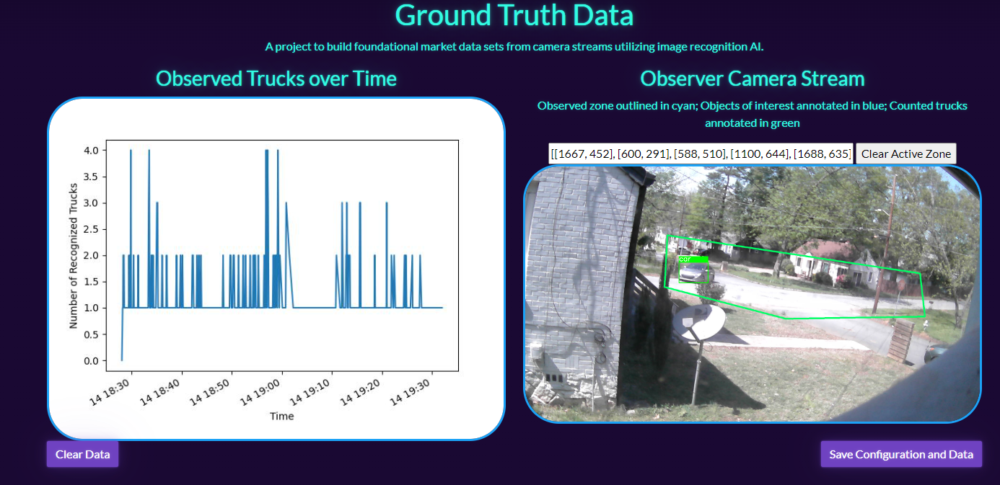

# Ground Truth

A project to build foundational market data sets from camera streams utilizing image recognition AI.




Project Features:
* Live camera stream
  * Selection of portion of camera image to use in AI processing
* Object Recogntion AI
* Graph of Object Recognitions over Time

With a provided video stream, let's track and analyze the appearance of object classes over time.

Utilizing [Ultralytics YOLOv8](https://github.com/ultralytics/ultralytics), we can classify images for objects the model has been trained on. This can be used to build a dataset of observed objects over time. This can then be plotted to generate observed objects over time graphs.

## Camera Considerations
* Camera Perspective/Placement: cameras are best placed anti-parallel to the movement of objects to be observed; this reduces object blur
* Camera Resolution and Observation Area: a higher resolution camera and/or more of the camera's frame being occupied by the tracked objects will more reliable classifications

This notebook needs a camera stream that will return an JPG image frame with a simple GET request. For a Raspberry Pi, [ayufan's camerastreamer](https://github.com/ayufan/camera-streamer) is a fantastic choice. The URL for that camera stream should be set in the `CAMERA_STREAM` variable.


```python
CAMERA_STREAM = "http://localhost:8080/snapshot"
```


```python
import json
import random
from datetime import datetime, timedelta
from io import BytesIO
from time import sleep

import flask
from apscheduler.schedulers.background import BackgroundScheduler
import requests
import numpy as np
import cv2
import matplotlib.pyplot as plt
from ultralytics import YOLO
```


```python
model = YOLO("yolov8n.pt")
```


```python
try:
    with open("GroundTruth.json", "r") as f:
        groundTruthConfig = json.loads(f.read())
        groundTruthConfig['DATA'] = [(datetime.fromisoformat(d[0]), d[1]) for d in groundTruthConfig['DATA']]
except FileNotFoundError:
    groundTruthConfig = {
        "CLASSES_OF_INTEREST": [2, 5, 6, 7],
        "COUNT_CLASSES": [2, 7],
        "ACTIVE_ZONE": [(0, 0), (1920, 0), (1920, 1080), (0, 1080)],
        "DATA": [(datetime.utcnow(), {c: 0 for c in [2, 5, 6, 7]})]
    }

CLASSES_OF_INTEREST = groundTruthConfig['CLASSES_OF_INTEREST']
COUNT_CLASSES = groundTruthConfig['COUNT_CLASSES']
ACTIVE_ZONE = groundTruthConfig['ACTIVE_ZONE']
DATA = groundTruthConfig['DATA']
```


```python
def cropToActiveZone(image):
    pts = np.int32(ACTIVE_ZONE)
    mask = np.zeros(image.shape[:2], np.uint8)
    cv2.drawContours(mask, [pts], -1, (255, 255, 255), -1, cv2.LINE_AA)
    dst = cv2.bitwise_and(image, image, mask=mask)
    return dst
        
def drawActiveZone(image):
    pts = np.int32(ACTIVE_ZONE)
    azOverlaidImage = image.copy()
    return cv2.polylines(azOverlaidImage, [pts], isClosed=True, color=(100, 255, 0), thickness=5)
```


```python
def collect_images(count=5, rotate=None):
    images = []
    try:
        for i in range(count):
            resp = requests.get(CAMERA_STREAM, stream=True).raw
            images.append(resp)
        images = [np.asarray(bytearray(resp.read()), dtype="uint8") for resp in images]
        images = [cv2.imdecode(image, cv2.IMREAD_COLOR) for image in images]
        images = [cv2.resize(camImage, (1920, 1080)) for camImage in images]
        if rotate:
            images = [cv2.rotate(camImage, rotate) for camImage in images]

        return images
    except Exception as e:
        print(f"Failed to collect image: {e}")
    return images
```


```python
def demostrateCollectionAndRecognition():
    images = collect_images()
    aResults = []
    for image in images:
        results = model.track(image, persist=True, verbose=False)[0]
        aResults.append(results)
    fig, axes = plt.subplots(1, 5, figsize=(20, 4))
    for ax, i in zip(axes, aResults):
        ax.imshow(i.plot())
    plt.show()
```


```python
ANNOTATED_IMAGE = None

def captureAndAnalyzeImage():
    while True:
        camImage = collect_images(1)[-1]
        results = model(cropToActiveZone(camImage), verbose=False)[0]
    
        annotatedImage = camImage.copy()
        recognitions = 0
        if len(results.boxes) > 0:
            print(f"Detections at {datetime.utcnow()} - {[results.names[int(i)] for i in results.boxes.cls]}")
        recognitions = {c: 0 for c in CLASSES_OF_INTEREST}
        for box in results.boxes:
            if box.cls[0] in CLASSES_OF_INTEREST:
                label = results.names[int(box.cls[0])]
                print(f"Saw {label}: {box.xyxy}")
                x1, y1, x2, y2 = [int(i) for i in box.xyxy[0]]
                color = (0, 255, 0) if box.cls[0] in COUNT_CLASSES else (255, 0, 0)
                cv2.rectangle(annotatedImage, (x1, y1), (x2, y2), color, 2)
                cv2.rectangle(annotatedImage, (x1, y1 - 25), (x2, y1), color, -1)
                cv2.putText(annotatedImage, label, (x1, y1 - 5), cv2.FONT_HERSHEY_SIMPLEX, 1, (255, 255, 255), 2)
                recognitions[int(box.cls[0])] += 1
        DATA.append((datetime.utcnow(), recognitions))

        global ANNOTATED_IMAGE
        ret, encodedImage = cv2.imencode('.jpg', drawActiveZone(annotatedImage))
        ANNOTATED_IMAGE = encodedImage.tobytes()
```


```python
def camStream():
    while ANNOTATED_IMAGE is None:
            sleep(5)

    while True:
        yield(b'--frame\r\n'
              b'Content-Type: image/jpg\r\n\r\n' + ANNOTATED_IMAGE + b'\r\n')
```


```python
ANALYZER_IMAGE = None

def buildAnalyzer():
    while True:
        x, y = zip(*DATA)
        y = [sum([v for k, v in yi.items() if k in COUNT_CLASSES]) for yi in y]
        fig, ax = plt.subplots()
        ax.plot(x, y)
        plt.xlabel("Time")
        plt.ylabel("Number of Recognized Trucks")
        fig.autofmt_xdate()
        img_bytes = BytesIO()
        plt.savefig(img_bytes, format="jpg")
        img_bytes.seek(0)
        plt.close(fig)

        global ANALYZER_IMAGE
        ANALYZER_IMAGE = img_bytes.read()
```


```python
def dataStream():
    while ANALYZER_IMAGE is None:
        sleep(5)

    while True:
        yield(b'--frame\r\n'
              b'Content-Type: image/jpg\r\n\r\n' + ANALYZER_IMAGE + b'\r\n')
```


```python
def generate_oot(*args, **kwargs):
    with open('templates/OOT.html', 'r') as f:
        ootTemplate = f.read().replace("{active_zone}", json.dumps(ACTIVE_ZONE))
    return ootTemplate
```


```python
app = flask.Flask(__name__)

@app.route('/')
def index():
    return flask.Response(generate_oot(), mimetype="text/html")

@app.route('/observer')
def observer():
    return flask.Response(camStream(), mimetype='multipart/x-mixed-replace; boundary=frame')

@app.route('/analyzer')
def analyzer():
    return flask.Response(dataStream(), mimetype='multipart/x-mixed-replace; boundary=frame')

@app.route('/active_zone', methods=['POST'])
def set_active_zone():
    new_active_zone = json.loads(flask.request.form['az'])
    if new_active_zone == []:
        new_active_zone = [(0, 0), (1920, 0), (1920, 1080), (0, 1080)]
    global ACTIVE_ZONE
    ACTIVE_ZONE = new_active_zone
    return json.dumps(ACTIVE_ZONE)

def saveState(snapshot=False):
    global DATA
    state = json.dumps({
        "CLASSES_OF_INTEREST": CLASSES_OF_INTEREST,
        "COUNT_CLASSES": COUNT_CLASSES,
        "ACTIVE_ZONE": ACTIVE_ZONE,
        "DATA": [(d[0].isoformat(), d[1]) for d in DATA]
    })
    with open("GroundTruth.json", "w") as f:
        f.write(state)

    if snapshot:
        with open(f"GroundTruth-{datetime.utcnow().isoformat()}.json", "w") as f:
            f.write(state)
        DATA =  [(datetime.utcnow(), {c: 0 for c in CLASSES_OF_INTEREST})]

@app.route('/save', methods=['POST'])
def saveRequest():
    saveState(snapshot=True)
    return "saved"

@app.route('/clear_data', methods=['POST'])
def clearData():
    global DATA
    DATA =  [(datetime.utcnow(), {c: 0 for c in CLASSES_OF_INTEREST})]
    saveState()
    return "cleared"

@app.route('/bootstrap.min.css', methods=['GET'])
def getBSCSS():
    with open("templates/bootstrap.min.css", "r") as f:
        bscss = f.read()
    return flask.Response(bscss, mimetype="text/css")
    
@app.route('/bootstrap.min.js', methods=['GET'])
def getBSJS():
    with open("templates/bootstrap.min.js", "r") as f:
        bsjs = f.read()
    return flask.Response(bsjs, mimetype="application/javascript")
    
@app.route('/htmx.min.js', methods=['GET'])
def getHTMX():
    with open("templates/htmx.min.js", "r") as f:
        htmx = f.read()
    return flask.Response(htmx, mimetype="application/javascript")


## Periodic tasks for capturing images and analyzing data
scheduler = BackgroundScheduler(daemon=True)
scheduler.add_job(captureAndAnalyzeImage, 'interval', seconds=2)
scheduler.add_job(buildAnalyzer, 'interval', seconds=5)
scheduler.add_job(saveState, 'interval', seconds=300)
```


```python
if __name__ == "__main__":
    print(f"Launching Observer Server on 7777")
    scheduler.start()
    app.run(host="0.0.0.0", port=7777)
```


```python

```
